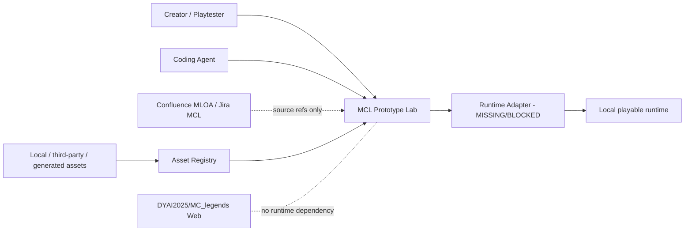
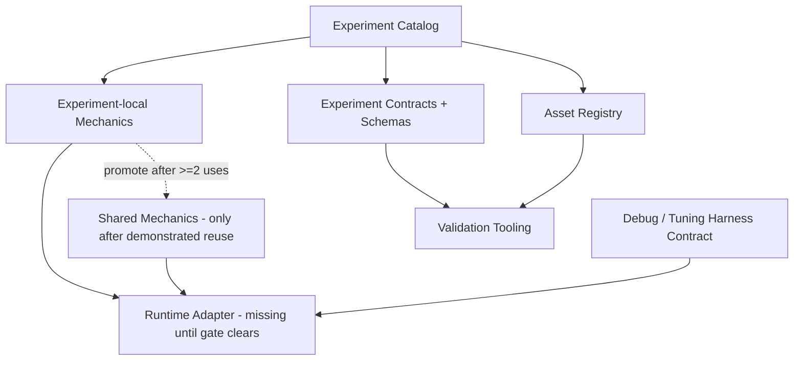

# C4-lite - Prototype Lab Concept

## System context

## Containers / modules

Key rule: the adapter isolates runtime boot/scene/input/asset/debug integration. It is not a promise that all game logic will be engine-independent.
