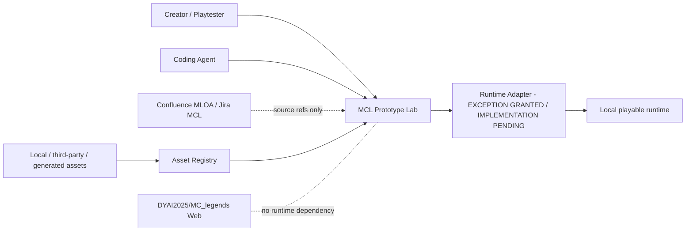
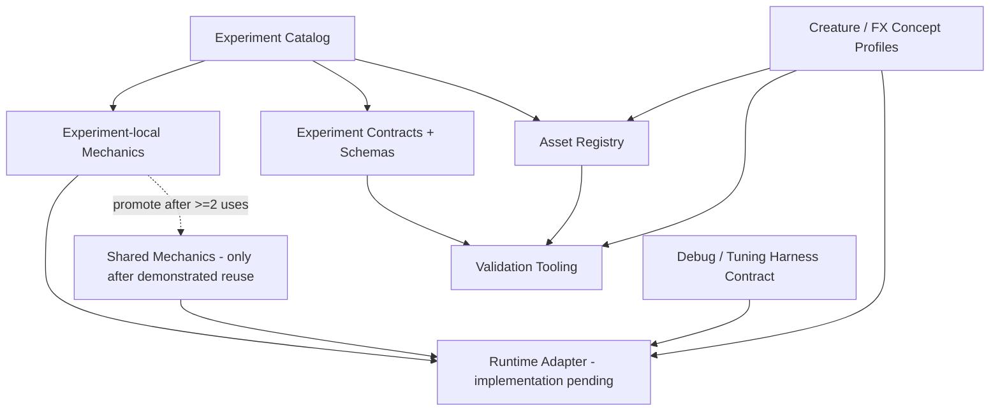

# C4-lite - Prototype Lab Concept

## System context

## Containers / modules

Key rule: the adapter isolates runtime boot/scene/input/asset/debug/visual integration. It is not a promise that all game logic will be engine-independent.

## Visual concept boundary

The runtime foundation must be visually capable enough to evaluate source-linked creature concepts, but it must not become a final creature framework. `concepts/creatures/*.json` supplies data-driven visual profiles for Mugosh, Flammenwolf, Veras and Zhalm; the runtime may render them with primitives first and later replace geometry through stable asset IDs.
